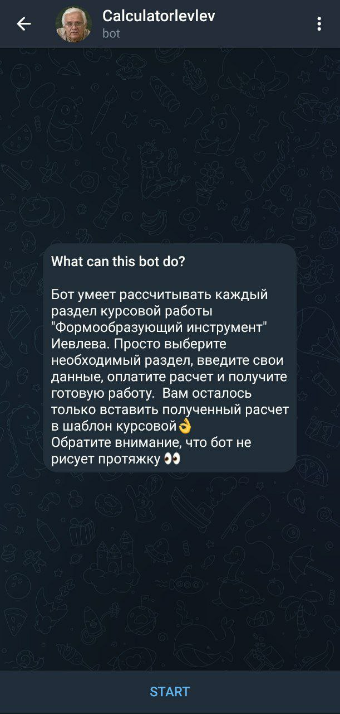
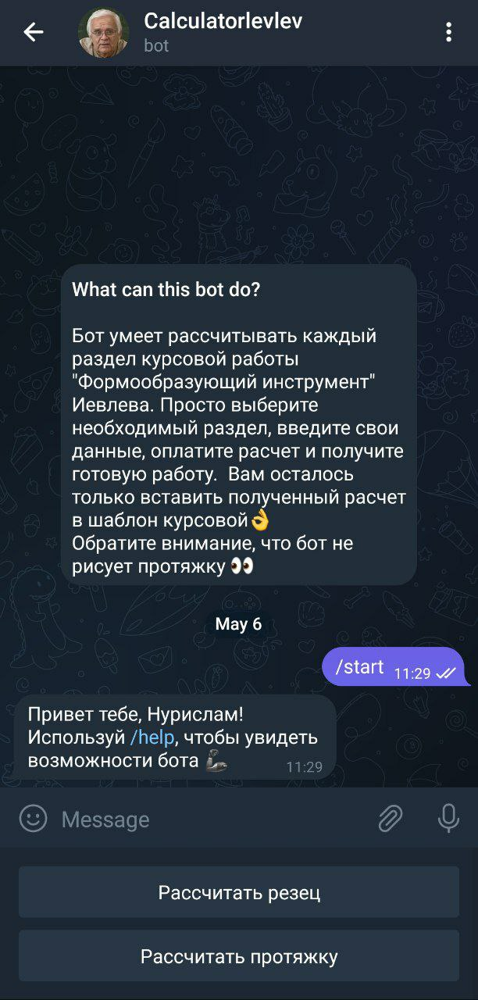
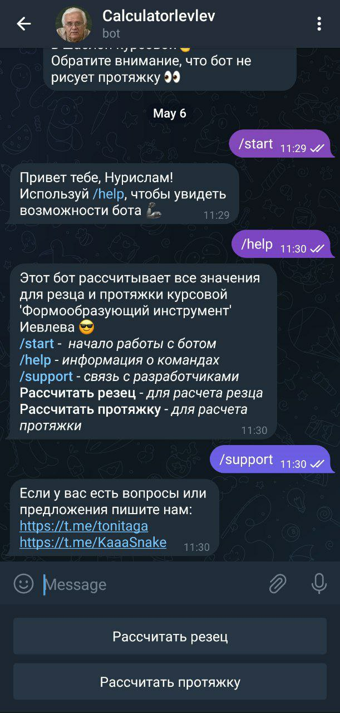
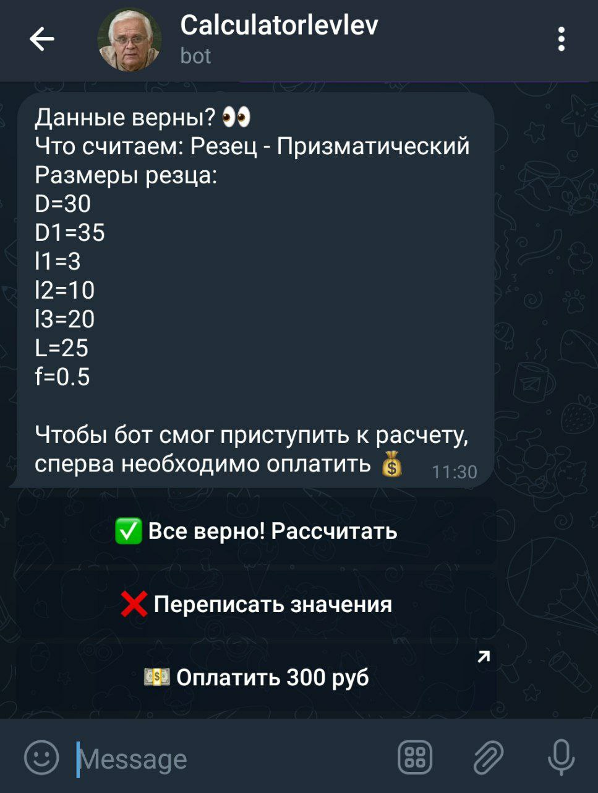
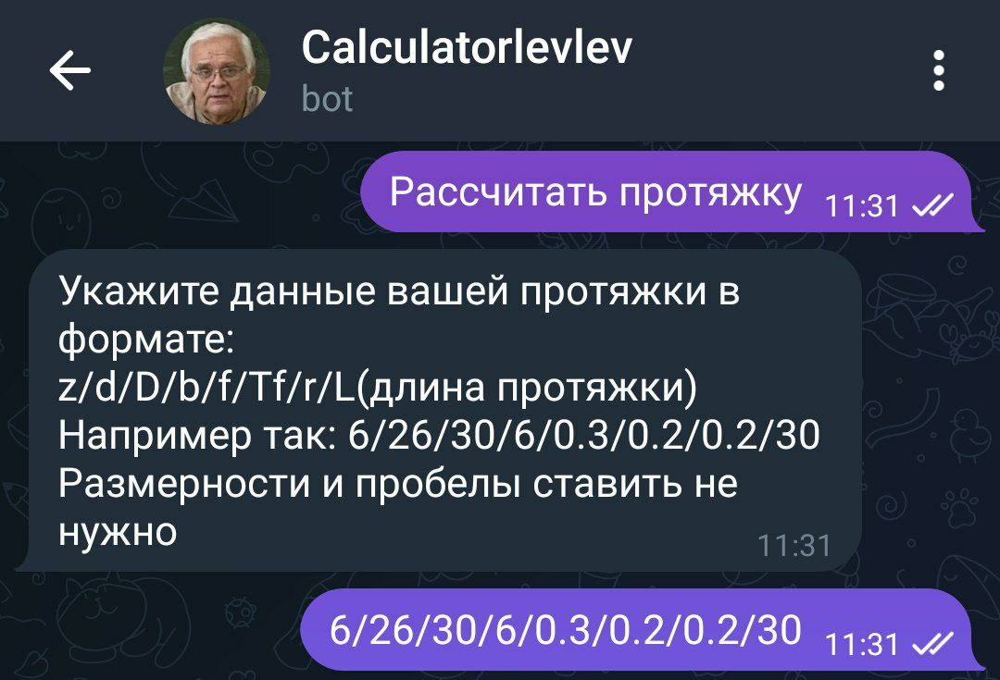
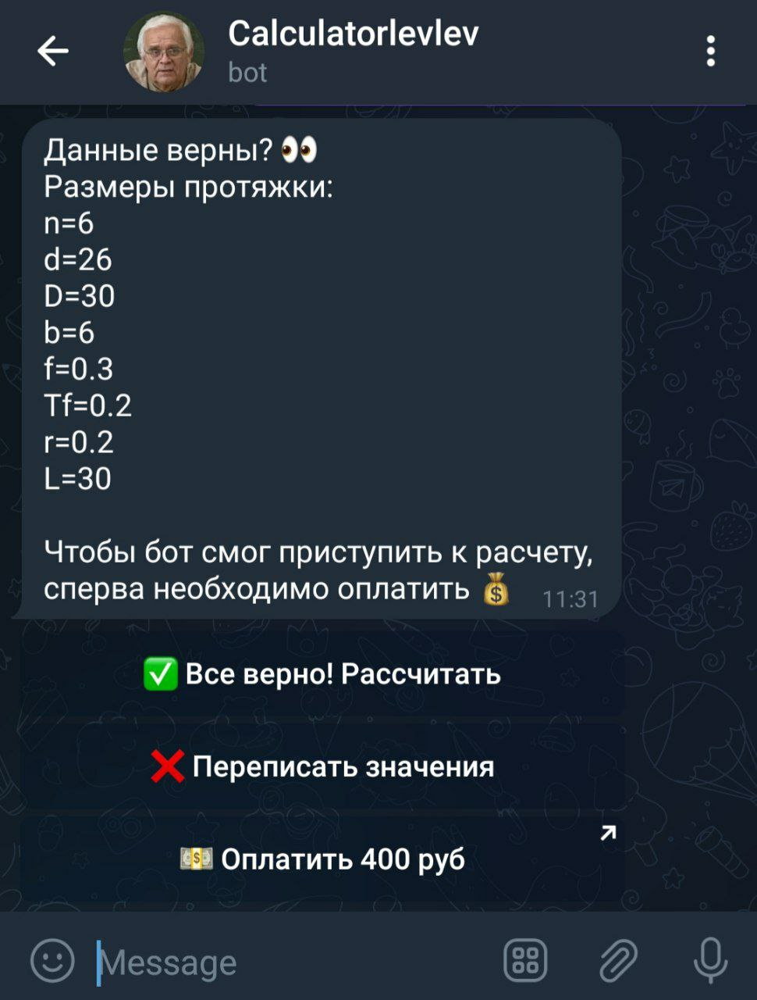

# CourseWorkSolver

---

## Contents

1. [Developers](#developers)
2. [Project idea](#project-idea)
3. [References](#references)
4. [How the bot looks like?](#how-the-bot-looks-like)
5. [Solved Course Work](#solved-course-work)

---

---

### Developers: 
- Gubaydullin Nurislam (CourseWorkEngine)
- Kulikov Dmitry (BotEngine)

---

### Project idea
* A coursework from the Kazan Aviation Institute on "Moulds" subject was the basis for the idea.

* We felt that the coursework was very time-consuming to do the calculations.

* We decided to make life easier for our course mates.

---

### References

* First of all, I would like to share a link to the bot 
[Course Work Solver Bot](https://web.telegram.org/a/#6235079121)
* Or you can find our bot by QR-code

---

### How the bot looks like?

* Bot start state

* Bot help and support command

* Bot cutter solve state

* Bot broach solve state

---

### Solved Course Work

* The bot writes the solution of coursework into a .txt file and sends it to the user, the user only needs to paste these calculations into the coursework template
* How the solved coursework part looks like?

---

#### © tonitaga (Gubaydillin Nurislam) 07.05.2023