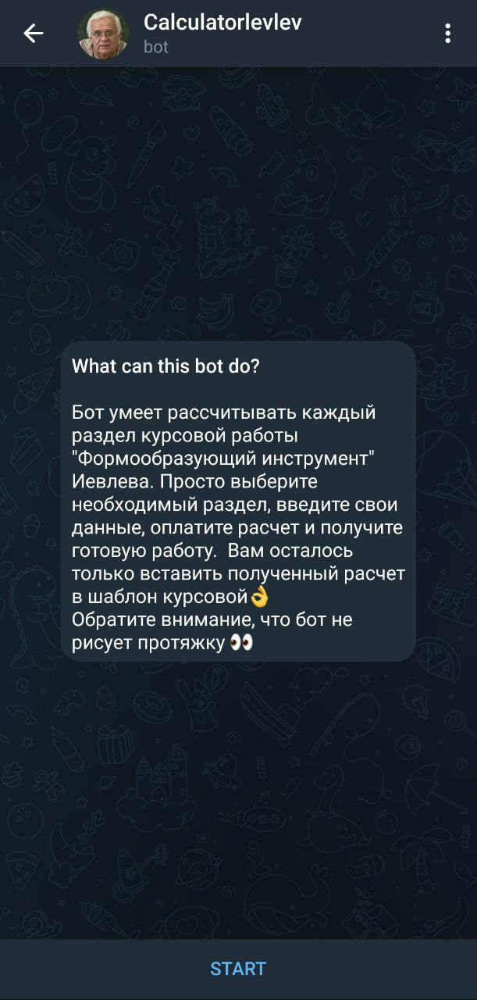
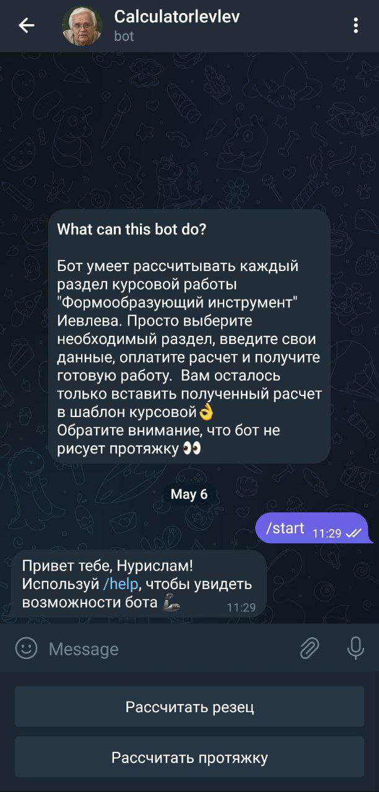
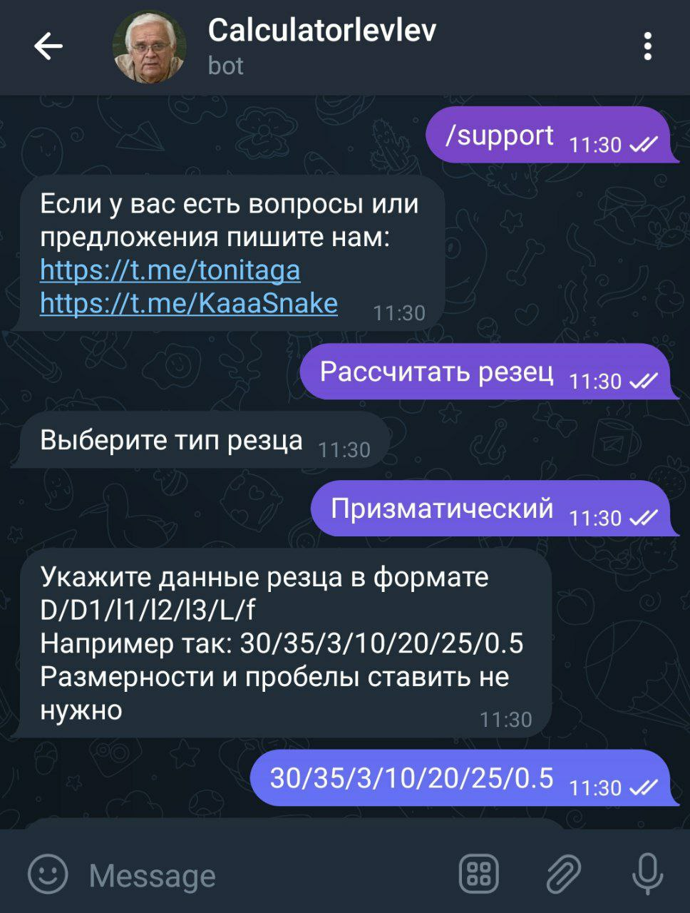
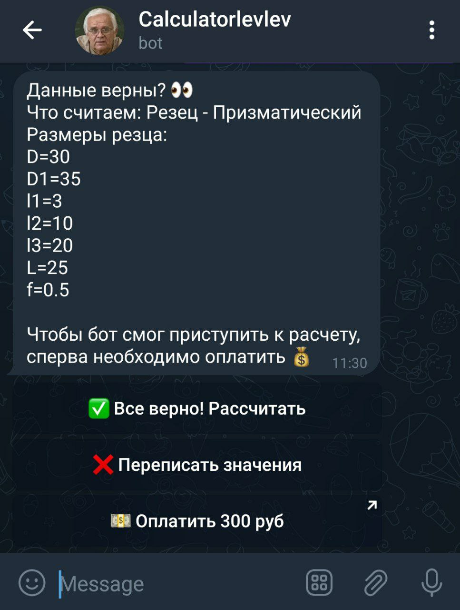
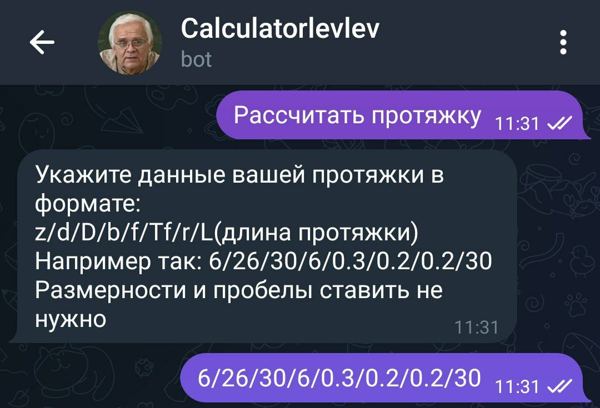
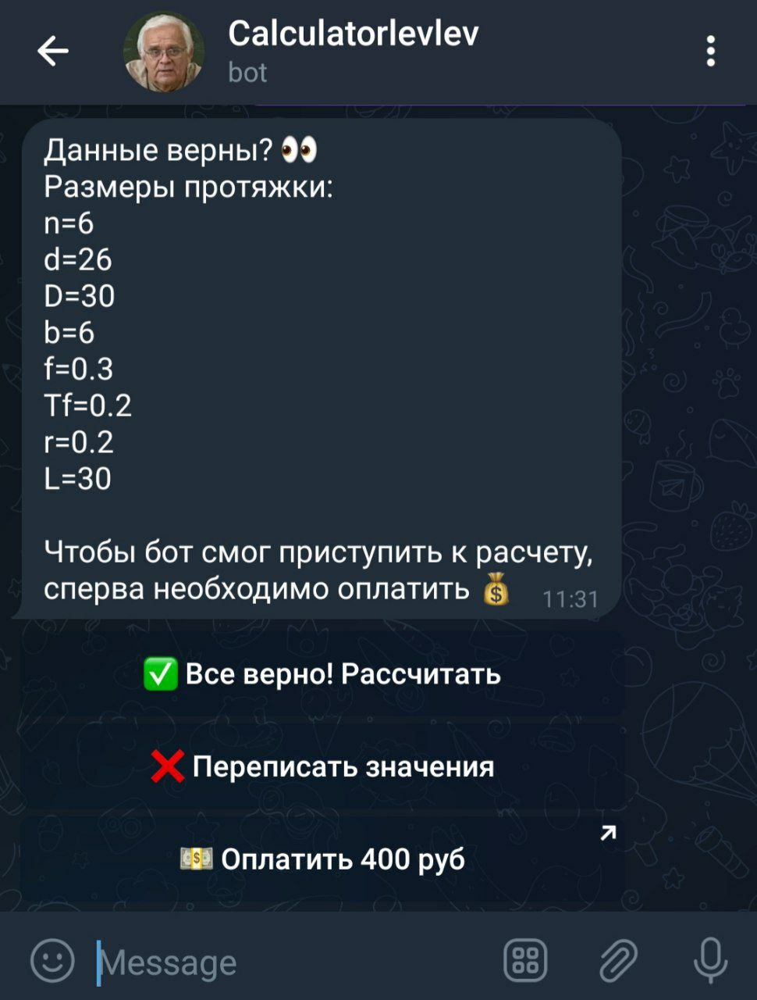
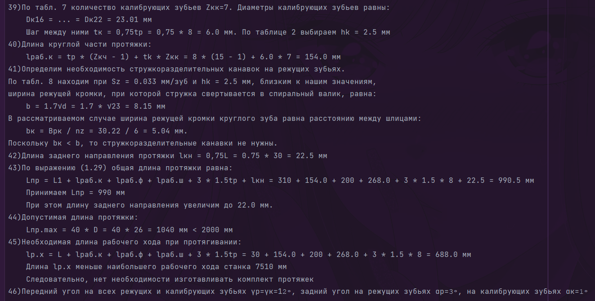
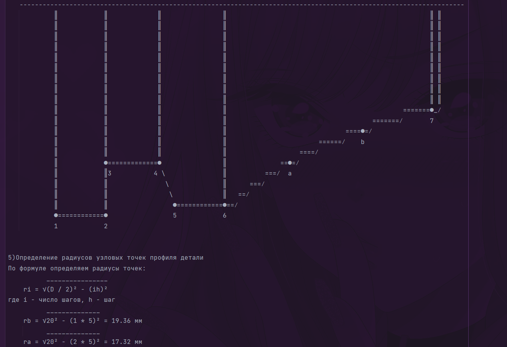
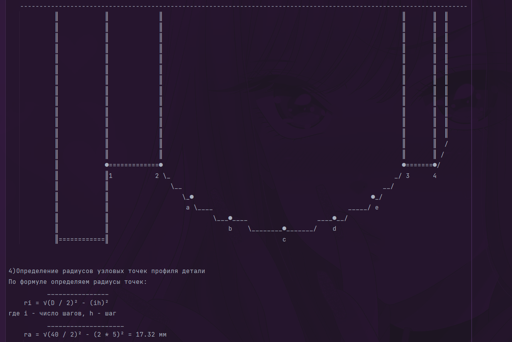

# CourseWorkSolver

---

## Содержание

1. [Разработчики](#разработчики)
2. [Идея проекта](#идея-проекта)
3. [Ссылки](#ссылки)
4. [Как выглядит бот?](#как-выглядит-бот)
5. [Решенная курсовая работа](#решенная-курсовая-работа)

---

---

### Разработчики: 
- Губайдуллин Нурислам (CourseWorkEngine)
- Куликов Дмитрий (BotEngine)

---

### Идея проекта
* За основу идеи проекта легла курсовая работа Казанского Авиационного института по предмету "Формообразующий инструметр"

* Мы подумали, что курсовая работа требует очень много времени, чтобы проделать все расчеты.

* Мы решили сделать жизнь наших однокурсников чуточку легче.

---

### Ссылки

* В первую очередь, хотелось бы поделиться ссылкой на бота
[Course Work Solver Bot](https://web.telegram.org/a/#6235079121)
* Или вы можете воспользоваться QR кодом

---

### Как выглядит бот?

* Стартовое состояние бота

* Команды help и support

* Состояние предрешения резца

* Состояние предрешения протяжки

---

### Решенная курсовая работа

* Бот сохраняет подробные расчеты в .txt файл и отправляет пользователю. Пользователю остается лишь внести расчеты в шаблон курсовой работы.
* Как выглядят решенные части курсовой работы

---

#### © tonitaga (Губайдуллин Нурислам) 07.05.2023